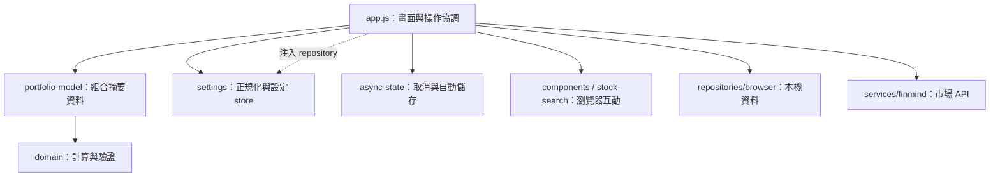

# 開發與 Next.js 遷移指南

本指南供維護者與 AI agent 共用。閱讀順序為根目錄 `AGENTS.md` → 本文件 → 目標模組及相關測試。更新日期：2026-09-08。

## 現在的架構

本專案仍是原生 JavaScript 靜態網頁，沒有 React／Next.js 執行環境。使用者開啟 `index.html`，載入由來源模組產生的 `app.bundle.js`；資料透過瀏覽器 repository 存在 IndexedDB 或本機儲存。

目錄名稱不是執行環境的保證：`js/app/settings.js` 可在沒有 DOM 的環境匯入；同目錄的 `stock-search.js` 則包含瀏覽器互動。依實際依賴區分。

| 位置 | 責任 | 未來遷移方式 |
| --- | --- | --- |
| `js/domain/` | 持股、配息、退休、趨勢、匯入驗證 | 保留計算與測試，視需要補 TypeScript 型別 |
| `js/app/portfolio-model.js` | 組合持股、價格、股息、資產及預測 | React 頁面或伺服器直接呼叫 |
| `js/app/settings.js` | 預設設定、相容舊資料、序列化寫入與訂閱 | 每個客戶端 Provider 建立 store，注入資料介面 |
| `js/app/async-state.js` | 可取消工作與延遲儲存 | 保留控制邏輯，接上 React 的建立與清理生命週期 |
| `js/repositories/browser.js` | 現有瀏覽器資料存取 | 初期沿用；雲端化時新增有相同契約的介面 |
| `js/services/finmind.js` | 市場請求、逾時與取消 | 決定留在客戶端或由伺服器代理，保留錯誤語意 |
| `app.js`、`js/components/`、`js/app/stock-search.js` | HTML、DOM、路由與 UI 狀態 | 按功能改寫成 React 元件／hooks |
| `styles.css` | 目前樣式與設計 token | 先保留視覺結果，再按元件範圍整理 |
| `scripts/build-static.cjs`、`app.bundle.js` | 支援本機 HTML 的建置 | 正式切換交付方式後交由 Next.js 建置取代 |

## 已建立的核心介面

### 設定

`normaliseSettings(source, { asOfMonth, resetMarketSync })` 負責載入與還原的相容規則；`asOfMonth` 由呼叫端明確提供。載入與還原都使用這個入口，避免兩套規則逐漸不同。

`createSettingsStore({ repository, initialSettings })` 的 repository 只需提供非同步 `save(record)`，因此核心不需要知道資料存在 IndexedDB 還是伺服器。

- `getSnapshot()`：讀取目前設定；未變更時保持同一參照。
- `getRevision()`：讀取資料版本，供載入流程辨識舊快照。
- `subscribe(listener)`：成功更新後通知，回傳解除訂閱函式。
- `save(patch)`：排隊寫入，寫入成功後才更新快照；失敗會拒絕該次 Promise，後續寫入仍可執行。
- `replace(snapshot)`：替換記憶體狀態並通知，不寫入 repository。
- `whenIdle()`：等待已排隊寫入結束；寫入錯誤由各次 `save()` 的呼叫端處理。

快照視為唯讀，不得直接修改 `getSnapshot()` 的屬性。`app.js` 現階段由訂閱更新讀取參照，畫面不再自行修改設定預設值。

載入流程先等待寫入，記住 revision，再讀 repository；資料返回時只有 revision 仍相同才套用設定。清除／還原另須等待舊寫入與資料遷移後再替換。`replace()` 本身不是取消請求或中止寫入的工具。

未來 React 可以使用此訂閱介面搭配 `useSyncExternalStore`。store 要由對應使用者／Provider 持有，避免在 Next.js 伺服器模組中建立跨請求共享的使用者設定。SSR 初始快照需與首次客戶端渲染一致；本機儲存資料在瀏覽器掛載後讀取。

### 投資摘要

`calculatePortfolioSnapshot({ transactions, marketCaches, dividendDateBasis, asOfDate, requiredThroughDate })` 回傳以下資料：

- 持股與各股票最新價格。
- 資產、成本與股息摘要。
- 年股息預測、涵蓋範圍及殖利率。

它不讀 DOM、不存資料、不發請求。`asOfDate` 是報表日期，`requiredThroughDate` 是市場資料應涵蓋的交易日；兩者可能因週末或休市而不同。未取得報價時保留成本估算，股息歷史不足時保留 coverage 資訊，畫面必須呈現這些限制。

這裡的 `asOfDate` 控制股息報表與預測期間；持股及最新報價仍取自全部輸入資料。因此這個介面供目前的投資摘要使用。若要計算指定歷史日期的持倉，應另外建立會按日期截取交易與報價的入口，並補上歷史計算測試。

目前 `app.js` 依交易陣列、快取陣列、日期與股息依據快取摘要。更新資料時必須替換陣列參照，否則快取不會失效。核心輸出為普通資料物件，方便未來作為 API 回應或畫面 props。

## 建議的遷移順序

1. **建立 Next.js 基礎與資料型別。** 新建 layout、頁面路由與型別；沿用 domain、設定與摘要模組。此步才安裝 Next.js／React，現階段不需要框架相依套件。
2. **先遷移設定頁。** 接上 settings store、錯誤／重試與瀏覽器 repository，驗證訂閱及卸載時的儲存處理。
3. **逐頁遷移總覽、交易、預算與試算。** HTML 字串改成 React 元件，事件改成 React handlers，頁面草稿留在元件狀態；計算仍呼叫原核心。
4. **遷移同步及互動生命週期。** 明確定義控制器的建立、取消與清理，涵蓋下列清單。
5. **另一步加入登入與雲端資料。** 實作 API、使用者權限、資料庫及資料遷移，保留備份匯入入口。Next.js 本身不會將本機資料自動上傳或同步。
6. **驗收後移除舊入口與建置。** 保留 domain／store 測試，將 DOM 模擬及字串結構測試逐步換成 React 互動與真實瀏覽器測試。

新專案可採 `src/app/` 放路由，`src/components/` 放 React 元件，`src/domain/` 放計算，`src/application/` 放設定與摘要組合，`src/data/` 放客戶端／伺服器資料介面。這是未來建議布局，目前目錄尚未改成這套結構。

## 尚未完成的生命週期工作

目前 `app.js` 仍有模組層級 UI 狀態，匯入會讀取 DOM、註冊事件並啟動載入。它不能直接匯入 Server Component，也尚未提供可重複 mount/dispose 的介面。

將現有畫面暫時嵌入 React 前，至少需要完成：

- 對 `visibilitychange`、`online`、`hashchange` 註冊與解除成對處理。
- 卸載立即使舊工作失效，取消同步並等待已開始的寫入；舊 callback 不得重新排程或更新新畫面。
- 處理載入、檔案讀取、儲存與還原確認中的 Promise；一般切頁／卸載應保留已輸入設定，清除／還原才丟棄舊待儲存值。
- 清理拖曳期間的 document pointer listeners、長按數字按鈕 interval、Undo timer 及焦點／圖表 animation frame。
- 對話框、確認視窗、toast 與股票搜尋改成由實例管理，清理 body 狀態、inert、焦點、blur timer 及未完成請求。
- DOM 查詢限制在自己的掛載範圍，避免舊實例操作新頁面同 ID 的元素。

須以重複掛載、未完成請求中卸載、拖曳／長按中卸載等測試驗證。較直接的路線是逐頁重建 React UI，沿用計算與資料模組。

## 客戶端、伺服器與本機資料

互動狀態與 `window`、localStorage、IndexedDB 放在客戶端生命週期。`'use client'` 不代表匯入及首次渲染可以任意讀取瀏覽器物件，Client Components 仍可能被預先渲染。

伺服器可使用純計算與摘要模組，但資料必須來自具備使用者權限的介面。各層交界採普通資料物件與明確的日期字串，是本專案方便備份、測試與 API 交換的約定。

現有資料依瀏覽器與網站來源儲存。從 `file://` 換到網站網址，或更換網域時，應提供 JSON 備份匯出／還原流程，不能假設新來源可以直接讀取舊資料。

Next.js 靜態匯出可繼續使用靜態主機，但應規劃透過網址開啟；目前雙擊 HTML 的交付方式不應被視為自動保留。登入、動態寫入 API 等功能則需相應的服務端設施。

官方參考：[Server／Client Components](https://nextjs.org/docs/app/getting-started/server-and-client-components)、[Static Exports](https://nextjs.org/docs/app/guides/static-exports)、[Project Structure](https://nextjs.org/docs/app/getting-started/project-structure)。採用時核對目標 Next.js 版本。

## 驗證方式

在專案根目錄執行 `node scripts/build-static.cjs`、`node --test`、`node scripts/build-static.cjs --check`、`git diff --check`。本次驗證環境為 Node.js 26.8.1。

- `tests/architecture.test.js`：阻止可重用模組依賴畫面／儲存／網路，檢查無瀏覽器環境匯入。
- `tests/settings-store.test.js`：設定訂閱、寫入排隊、失敗恢復與實例隔離。
- `tests/portfolio-model.test.js`：摘要一致性、估算語意與跨時區日期。
- 其餘測試涵蓋既有計算、同步取消、清除還原、設定競爭、互動及靜態產物。

`tests/support/` 的 VM／模擬 DOM 只用於測試，未被打包。既有部分測試會查看或替換程式字串；後續改寫 React 時應保留它們所保護的行為，逐步改用公開介面驗證。

自動測試通過不能代替實際瀏覽器排版、鍵盤與行動裝置驗收。當工具政策阻擋瀏覽器驗證時，應列出限制，不得宣稱已完成視覺驗收。
